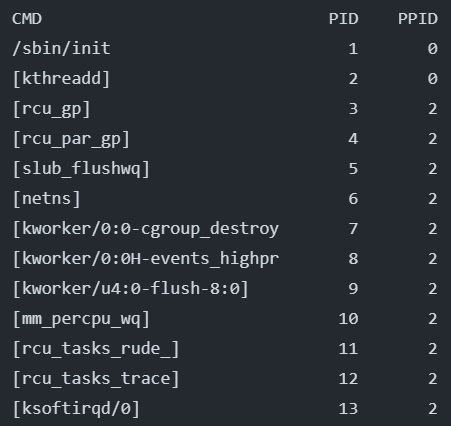

# Task: List of Processes in Linux

Bash script `list_processes.sh` that uses the `ps` command to list all currently running processes, including their respective command names, process IDs (PIDs), and parent process IDs (PPIDs).
Here is an examle of result:

